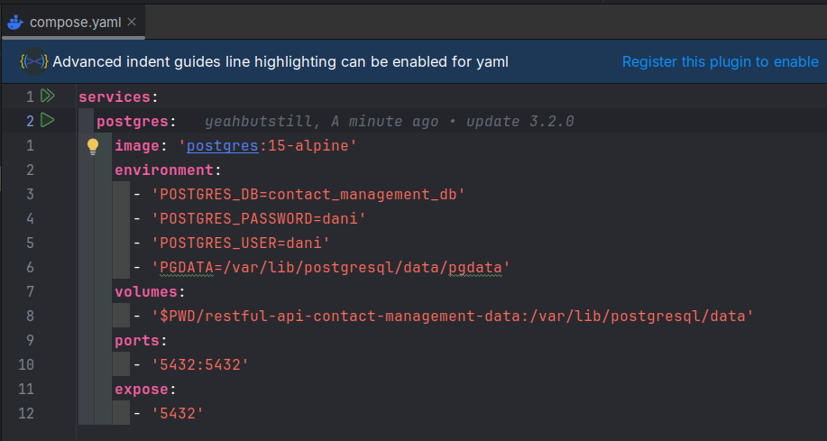

# Contact Management

## Run Container PostgreSQL
Kalau terkena Connection refused saat menjalankan Apps Spring boot, ini karena si Docker itu seolah-olah jalan di computer lain atau Virtual Machine jadi portnya itu tidak kelihatan dari si laptop.
Maka dari itu kita harus mengluarkan port tersebut atau mengexposenya.
https://software.endy.muhardin.com/linux/intro-docker


jalan kan compose.yaml


atau dengan command line ini, tapi hapus dulu dependency spring-boot-composer yang ada di pom.xml

```shell
docker run --rm --name restful-api-contact-management -e POSTGRES_DB=contact_management_db -e POSTGRES_USER=dani -e POSTGRES_PASSWORD=dani -e PGDATA=/var/lib/postgresql/data/pgdata -v "$PWD/restful-api-contact-management-data:/var/lib/postgresql/data" -p 5432:5432 postgres:15
```

## Jalankan Vault
```shell
# Masuk ke container vault
docker exec -it contact-management-vault-1 sh 
export VAULT_ADDR='http://127.0.0.1:8288'
export VAULT_TOKEN='root-token-for-dev-purpose-only'
```

## Jalankan Terraform
Buka terminal baru
```shell
cd tf-provisioner
terraform init
terraform apply
```

## Baca Secret, Root-ID, tulis Secret-ID
Balik lagi ke terminal container vault
```shell
vault kv get secret/aplikasi/contact-management

# jalankan ini ambil datanya untuk nanti dimasukan ke application.properties
vault read auth/approle/role/jawasundapadangbetawi/role-id
vault write -force auth/approle/role/jawasundapadangbetawi/secret-id

# masuk ke application.properties lalu isi role-id dan secret-id
# spring.cloud.vault.app-role.role-id=b830f1e1-63fc-0ce5-46e1-21f79c048513
# spring.cloud.vault.app-role.secret-id=48e63ee2-f596-6e2f-cebe-466251dae922
```


## Login psql
masuk ke container DB nya
```shell
docker exec -it contact-management-db-contact-management-1 sh
psql -U dani -d contact_management_db
select * from flyway_schema_history;
```

Atau kalau sudah install client PSQL bisa pakai ini:
```shell
psql -h 127.0.0.1 -U dani contact_management_db
\x ## Expanded display is on. like \G on MySQL
select * from flyway_schema_history;
```

## Run Qodana

```shell
docker run --rm -it -p 8080:8080 -v $PWD:/data/project/ jetbrains/qodana-jvm --show-report
```

# User API Spec

## Register User

Endpoint : POST /api/v1/users

Request Body :

```json
{
  "username": "yeahbutstill",
  "password": "rahasia",
  "name": "Dani"
}
```

Response Body (Success) :

```json
{
  "data": "OK"
}
```

Response Body (Failed) :

```json
{
  "errors": "Username must not blank, ???"
}
```

## Login User

Endpoint : POST /api/v1/auth/login

Request Body :

```json
{
  "username": "yeahbutstill",
  "password": "rahasia"
}
```

Response Body (Success) :

```json
{
  "data": {
    "token": "TOKEN",
    "expiredAt": 2342342423423
    // milliseconds
  }
}
```

## Logout User

Endpoint : DELETE /api/v1/auth/logout

Request Header :

- X-API-TOKEN : Token (Mandatory)

Response Body (Success) :

```json
{
  "data": "OK"
}
```

## Get User

Endpoint : GET /api/v1/users/current

Request Header :

- X-API-TOKEN : Token (Mandatory)

Response Body (Success) :

```json
{
  "data": {
    "username": "yeahbutstill",
    "name": "Dani"
  }
}
```

Response Body (Failed, 401) :

```json
{
  "errors": "Unauthorized"
}
```

## Update User

Endpoint : PATCH /api/v1/users/current

Request Header :

- X-API-TOKEN : Token (Mandatory)

Request Body :

```json
{
  "name": "Dani",
  // put if only want to update name
  "password": "newpassword"
  // put if only want to update password
}
```

Response Body (Success) :

```json
{
  "data": {
    "username": "yeahbutstill",
    "name": "Dani"
  }
}
```

Response Body (Failed, 401) :

```json
{
  "errors": "Unauthorized"
}
```

## Logout User

Endpoint : DELETE /api/v1/auth/logout

Request Header :

- X-API-TOKEN : Token (Mandatory)

Response Body (Success) :

```json
{
  "data": "OK"
}
```

# Contact API Spec

## Create Contact

Endpoint : POST /api/v1/contacts

Request Header :

- X-API-TOKEN : Token (Mandatory)

Request Body :

```json
{
  "firstName": "Dani",
  "lastName": "yeahbutstill",
  "email": "dani@example.com",
  "phone": "0899889998"
}
```

Response Body (Success) :

```json
{
  "data": {
    "id": "random-string",
    "firstName": "Dani",
    "lastName": "Setiawan",
    "email": "dani@example.com",
    "phone": "0899889998"
  }
}
```

Response Body (Failed) :

```json
{
  "errors": "Email format invalid, phone formar invalid, ..."
}
```

## Update Contact

Endpoint : PUT /api/v1/contacts/{idContact}

Request Header :

- X-API-TOKEN : Token (Mandatory)

Request Body :

```json
{
  "firstName": "Dani",
  "lastName": "Setiawan",
  "email": "dani@example.com",
  "phone": "0899889998"
}
```

Response Body (Success) :

```json
{
  "data": {
    "id": "random-string",
    "firstName": "Dani",
    "lastName": "Setiawan",
    "email": "dani@example.com",
    "phone": "0899889998"
  }
}
```

Response Body (Failed) :

```json
{
  "errors": "Email format invalid, phone formar invalid, ..."
}
```

## Get Contact

Endpoint : GET /api/v1/contacts/{idContact}

Request Header :

- X-API-TOKEN : Token (Mandatory)

Response Body (Success) :

```json
{
  "data": {
    "id": "random-string",
    "firstName": "Dani",
    "lastName": "Setiawan",
    "email": "dani@example.com",
    "phone": "0899889998"
  }
}
```

Response Body (Failed, 404) :

```json
{
  "errors": "Contact is not found"
}
```

## Search Contact

Endpoint : GET /api/v1/contacts

Query Param :

- name : String, contact first name or last name, using like query, optional
- phone : String, contact phone, using like query, optional
- email : String, contact email, using like query, optional
- page : Integer, start from 0, default 0
- size : Integer, default 10

Request Header :

- X-API-TOKEN : Token (Mandatory)

Response Body (Success) :

```json
{
  "data": [
    {
      "id": "random-string",
      "firstName": "Dani",
      "lastName": "Setiawan",
      "email": "dani@example.com",
      "phone": "0899889998"
    }
  ],
  "paging": {
    "currentPage": 0,
    "totalPage": 10,
    "size": 10
  }
}
```

Response Body (Failed) :

```json
{
  "errors": "Unauthorized"
}
```

## Remove Contact

Endpoint : DELETE /api/v1/contacts/{idContact}

Request Header :

- X-API-TOKEN : Token (Mandatory)

Response Body (Success) :

```json
{
  "data": "OK"
}
```

Response Body (Failed) :

```json
{
  "errors": "Contact is not found"
}
```

# Address API Spec

## Create Address

Endpoint : POST /api/v1/contacts/{idContact}/addresses

Request Header :

- X-API-TOKEN : Token (Mandatory)

Request Body :

```json
{
  "street": "Jalan apa",
  "city": "Kota",
  "province": "provinsi",
  "country": "Negara",
  "postalCode": "12313"
}
```

Response Body (Success) :

```json
{
  "data": {
    "id": "randomstring",
    "street": "Jalan apa",
    "city": "Kota",
    "province": "provinsi",
    "country": "Negara",
    "postalCode": "12313"
  }
}
```

Response Body (Failed) :

```json
{
  "errors": "Contact is not found"
}
```

## Update Address

Endpoint : PUT /api/v1/contacts/{idContact}/addresses/{idAddress}

Request Header :

- X-API-TOKEN : Token (Mandatory)

Request Body :

```json
{
  "street": "Jalan apa",
  "city": "Kota",
  "province": "provinsi",
  "country": "Negara",
  "postalCode": "12313"
}
```

Response Body (Success) :

```json
{
  "data": {
    "id": "randomstring",
    "street": "Jalan apa",
    "city": "Kota",
    "province": "provinsi",
    "country": "Negara",
    "postalCode": "12313"
  }
}
```

Response Body (Failed) :

```json
{
  "errors": "Address is not found"
}
```

## Get Address

Endpoint : GET /api/v1/contacts/{idContact}/addresses/{idAddress}

Request Header :

- X-API-TOKEN : Token (Mandatory)

Response Body (Success) :

```json
{
  "data": {
    "id": "randomstring",
    "street": "Jalan apa",
    "city": "Kota",
    "province": "provinsi",
    "country": "Negara",
    "postalCode": "12313"
  }
}
```

Response Body (Failed) :

```json
{
  "errors": "Address is not found"
}
```

## Remove Address

Endpoint : DELETE /api/v1/contacts/{idContact}/addresses/{idAddress}

Request Header :

- X-API-TOKEN : Token (Mandatory)

Response Body (Success) :

```json
{
  "data": "OK"
}
```

Response Body (Failed) :

```json
{
  "errors": "Address is not found"
}
```

## List Address

Endpoint : GET /api/v1/contacts/{idContact}/addresses

Request Header :

- X-API-TOKEN : Token (Mandatory)

Response Body (Success) :

```json
{
  "data": [
    {
      "id": "randomstring",
      "street": "Jalan apa",
      "city": "Kota",
      "province": "provinsi",
      "country": "Negara",
      "postalCode": "12313"
    }
  ]
}
```

Response Body (Failed) :

```json
{
  "errors": "Contact is not found"
}
```